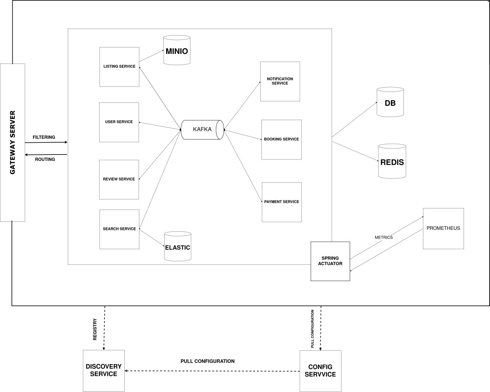

# RentSpaceBack: Microservices Rental Platform

RentSpaceBack is a modern, microservices-based rental platform built using Spring Boot, Docker, and a robust monitoring stack with Prometheus and Grafana. The system comprises services for user management, property listings, bookings, payments, reviews, notifications, and search, orchestrated via Docker Compose and automated with GitHub Actions for CI/CD.

## Table of Contents
- [Project Overview](#project-overview)
- [System Architecture](#system-architecture)
- [Services](#services)
- [Prerequisites](#prerequisites)
- [Setup Instructions](#setup-instructions)
- [CI/CD Pipeline](#cicd-pipeline)
- [Security and Permissions](#security-and-permissions)
- [Testing](#testing)
- [Monitoring and Observability](#monitoring-and-observability)
- [Troubleshooting](#troubleshooting)
- [Contributing](#contributing)
- [License](#license)

## Project Overview
RentSpaceBack is designed to provide a scalable and resilient rental platform. Key features include:
- **Microservices Architecture**: Modular services for scalability and maintainability.
- **Containerization**: Services are containerized using Docker and orchestrated with Docker Compose.
- **CI/CD Automation**: GitHub Actions automates building, testing, and deploying Docker images.
- **Monitoring**: Prometheus and Grafana provide real-time observability.
- **Infrastructure**: Includes PostgreSQL, Kafka, Redis, Elasticsearch, Minio, and pgAdmin.

## System Architecture
The platform follows a microservices architecture, with services communicating through a gateway and leveraging infrastructure components for data persistence, messaging, caching, and search.



## Services
### Custom Services
- **Config Service**: Centralizes configuration management.
- **Discovery Service**: Service registry using Eureka.
- **Gateway Service**: API gateway for routing requests.
- **User Service**: Manages user profiles and authentication.
- **Listing Service**: Handles property listings.
- **Booking Service**: Manages rental bookings.
- **Payment Service**: Processes payments.
- **Review Service**: Manages user reviews and ratings.
- **Notification Service**: Sends notifications via email or push.
- **Search Service**: Provides search functionality using Elasticsearch.

### Infrastructure Services
- **PostgreSQL**: Relational database for persistent storage.
- **pgAdmin**: Web-based database administration tool.
- **Minio**: S3-compatible object storage.
- **Kafka**: Message broker for event-driven communication.
- **Redis**: In-memory caching.
- **Elasticsearch**: Full-text search engine.
- **Prometheus**: Metrics collection and monitoring.
- **Grafana**: Visualization of metrics with preconfigured dashboards.

## Prerequisites
- **Docker** and **Docker Compose**
- **Git**
- **Maven** (for local builds)
- **Postman** (for API testing)
- A GitHub account and Docker Hub account for CI/CD

## Setup Instructions
1. **Clone the Repository**:
   ```bash
   git clone https://github.com/your-username/RentSpaceBack
   cd RentSpaceBack
   ```

2. **Set File Permissions**:
   ```bash
   chmod +x setup-permissions.sh
   ./setup-permissions.sh
   ```

3. **Start Services with Docker Compose**:
   ```bash
   docker-compose up --build -d
   ```

4. **Access Services**:

   | Service            | URL                          | Credentials                     |
   |--------------------|------------------------------|---------------------------------|
   | API Gateway        | `http://localhost:8072`      | -                               |
   | Grafana            | `http://localhost:3000`      | `admin/admin`                   |
   | Prometheus         | `http://localhost:9090`      | -                               |
   | pgAdmin            | `http://localhost:5050`      | `admin@admin.com/admin`         |
   | Minio              | `http://localhost:9000`      | `minioadmin/minioadmin`         |
   | Eureka Dashboard   | `http://localhost:8761`      | -                               |
   | Elasticsearch      | `http://localhost:9200`      | -                               |
   | Redis              | `localhost:6379`             | -                               |
   | Kafka              | `localhost:9092`             | -                               |

## CI/CD Pipeline
The project uses **GitHub Actions** for continuous integration and deployment:
- **Trigger**: Push to the `main` branch.
- **Workflow**:
  1. Builds Spring Boot JARs using Maven.
  2. Creates Docker images tagged with `:latest` and `:<commit-sha>`.
  3. Pushes images to Docker Hub under `d0niiel/<service>` (e.g., `d0niiel/userservice`).
- **Deploy Latest Images**:
   ```bash
   docker-compose pull
   docker-compose up -d
   ```

## Security and Permissions
- **Non-Root Users**: Custom services run as user `1001` in Docker containers.
- **Restricted Permissions**: Configuration files and volumes are secured using `setup-permissions.sh`.
   ```bash
   ./setup-permissions.sh
   ```

## Testing
- Import the `RentSpace.postman_collection.json` into Postman to test APIs.
- Example API endpoints (via gateway):
  - **Users**: `http://localhost:8072/api/users`
  - **Listings**: `http://localhost:8072/api/listings`
  - **Bookings**: `http://localhost:8072/api/bookings`

## Monitoring and Observability
- **Prometheus**: Collects metrics at `http://localhost:9090`.
- **Grafana**: Visualizes metrics at `http://localhost:3000` with preconfigured dashboards for system health, performance, and service metrics.

## Troubleshooting
- **Maven Build Issues**:
  - Verify `pom.xml` for missing dependencies.
  - Skip tests with `mvn clean install -DskipTests`.
- **Docker Push Failures**:
  - Ensure `DOCKER_USERNAME` and `DOCKER_PASSWORD` are set in GitHub Secrets.
- **Service Startup Failures**:
  - Check `docker-compose.yml` for correct image tags and environment variables.
  - Inspect container logs with `docker logs <container-name>`.

## Contributing
Contributions are welcome! Please follow these steps:
1. Fork the repository.
2. Create a feature branch (`git checkout -b feature/your-feature`).
3. Commit changes (`git commit -m "Add your feature"`).
4. Push to the branch (`git push origin feature/your-feature`).
5. Open a pull request.

## License
This project is licensed under the MIT License. See the [LICENSE](LICENSE) file for details.